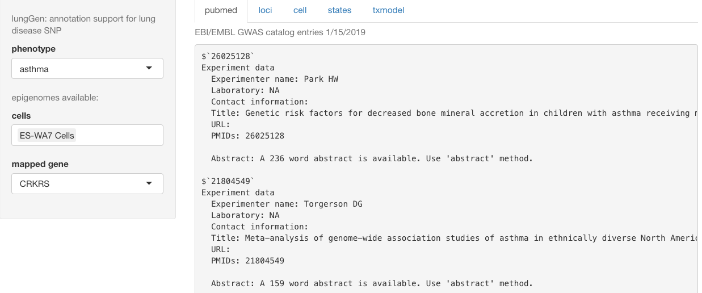
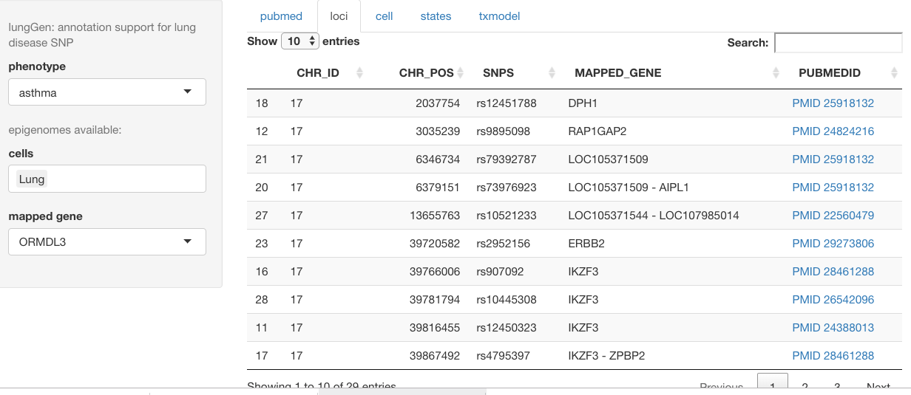
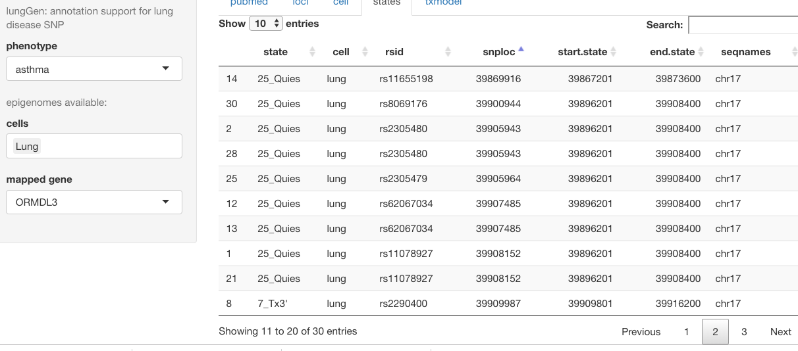
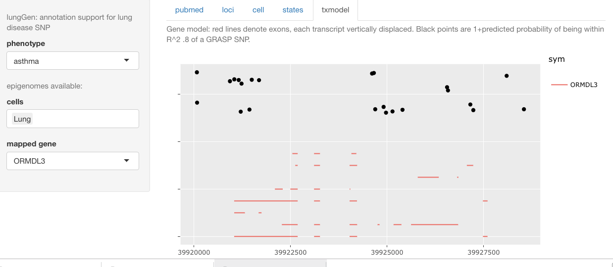

# Introduction

We are using a variety of reference resources to
characterize genomic context of DNA variants.

lungGen is a prototypical interactive resource to
help explore context.  Upon installation and
attachment of the package, invoking `lungGen()`
produces a browser page for interactive exploration.

# Interface components

## Overview

Sidebar panel allows selection of phenotype and gene
of interest.  Phenotype selection filters the GWAS
catalog (in this release, limited to GWAS hits on chr17),
gene selection is used for transcript model display
to be discussed below.

## Literature references

Note that a brief summary of all papers cited in the
GWAS catalog is provided on the front panel.  This will
be expanded to support abstract retrieval.  Locus-specific links to
pubmed are on the next tab.

## Locus details

## Epigenetic states enclosing loci

## Transcript model with predicted phenorelevance scores

